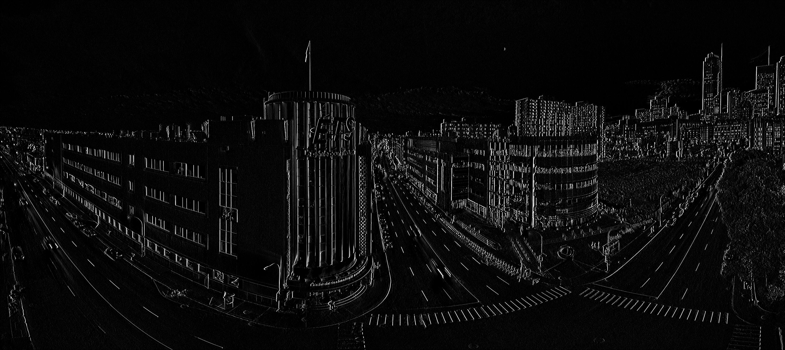

# <h1> Edge detection using sobel operators 

# <h2> Overview 

# <h2> Usage
Usage: ./main.py img_name

Output : It will generate 3 other images prefixed with "edges_x" "edges_y" and "edges_xy" corresponding to using the gradient in the x direction, y direction and then combining them both.

# <h2> Copyright
 
